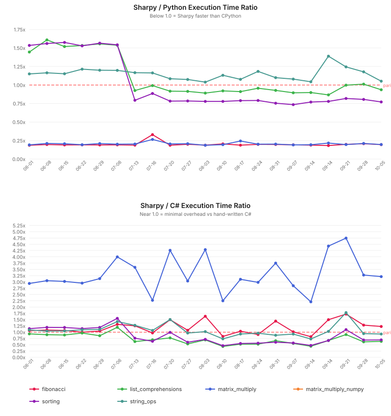

# Cross-Language Benchmark Results (2026-10-05)

**Runner:** `ubuntu-latest` | **Python:** 3.12 | **.NET:** 10.0 | **Runs:** 10 (median) + warmup | **Stats:** mean, median, stdev, p90, p99

## Execution Time (runtime only)

| Benchmark | Python | Sharpy | C# | Spy/Py | Spy/C# |
|-----------|--------|--------|-----|--------|--------|
| fibonacci | 212ms | 41ms | 34ms | 0.19x | 1.23x |
| list_comprehensions | 61ms | 57ms | 91ms | 0.94x | 0.63x |
| matrix_multiply | 801ms | 157ms | 49ms | 0.20x | 3.21x |
| matrix_multiply_numpy | FAIL | FAIL | 1.52s | — | — |
| sorting | 188ms | 145ms | 209ms | 0.77x | 0.69x |
| string_ops | 165ms | 174ms | 188ms | 1.05x | 0.93x |

## Compilation Time

| Benchmark | Python (.pyc) | Sharpy (cold) | Sharpy (warm) | Sharpy (server) | C# (dotnet build) | Spy/C# |
|-----------|---------------|---------------|---------------|-----------------|-------------------|--------|
| fibonacci | 525us | 2.01s | 1.73s | 201ms | 1.47s | 1.37x |
| list_comprehensions | 511us | 2.16s | 1.84s | 204ms | 1.45s | 1.49x |
| matrix_multiply | 705us | 2.24s | 1.89s | 221ms | 1.36s | 1.65x |
| matrix_multiply_numpy | 525us | — | — | — | 1.61s | — |
| sorting | 524us | 2.43s | 1.92s | 214ms | 1.39s | 1.74x |
| string_ops | 425us | 2.13s | 1.80s | 202ms | 1.39s | 1.53x |

## Execution Time Distribution

| Benchmark | Lang | Mean | Median | Stdev | P90 | P99 | Min | Max | N |
|-----------|------|------|--------|-------|-----|-----|-----|-----|---|
| fibonacci | Python | 213ms | 212ms | 3ms | 217ms | 220ms | 209ms | 221ms | 10 |
| fibonacci | Sharpy | 41ms | 41ms | 578us | 42ms | 43ms | 41ms | 43ms | 10 |
| fibonacci | C# | 34ms | 34ms | 2ms | 35ms | 41ms | 33ms | 42ms | 10 |
| list_comprehensions | Python | 62ms | 61ms | 1ms | 63ms | 63ms | 59ms | 63ms | 10 |
| list_comprehensions | Sharpy | 58ms | 57ms | 584us | 58ms | 59ms | 57ms | 59ms | 10 |
| list_comprehensions | C# | 91ms | 91ms | 962us | 92ms | 93ms | 89ms | 93ms | 10 |
| matrix_multiply | Python | 802ms | 801ms | 5ms | 811ms | 812ms | 795ms | 812ms | 10 |
| matrix_multiply | Sharpy | 157ms | 157ms | 2ms | 160ms | 160ms | 155ms | 160ms | 10 |
| matrix_multiply | C# | 49ms | 49ms | 1ms | 50ms | 52ms | 48ms | 53ms | 10 |
| matrix_multiply_numpy | C# | 1.54s | 1.52s | 65ms | 1.60s | 1.70s | 1.49s | 1.71s | 10 |
| sorting | Python | 188ms | 188ms | 2ms | 190ms | 191ms | 183ms | 191ms | 10 |
| sorting | Sharpy | 145ms | 145ms | 738us | 146ms | 146ms | 143ms | 146ms | 10 |
| sorting | C# | 209ms | 209ms | 2ms | 210ms | 214ms | 207ms | 215ms | 10 |
| string_ops | Python | 164ms | 165ms | 4ms | 168ms | 171ms | 156ms | 171ms | 10 |
| string_ops | Sharpy | 174ms | 174ms | 720us | 175ms | 175ms | 173ms | 175ms | 10 |
| string_ops | C# | 188ms | 188ms | 4ms | 192ms | 194ms | 182ms | 194ms | 10 |

## Performance Trend

> **Spy/Py < 1.0** = Sharpy execution faster than Python. **Spy/C# ≈ 1.0** = minimal overhead vs hand-written C#.

> **Sharpy (cold)** = single-file compile with no cache; **Sharpy (warm)** = `--incremental` one-file `.spyproj` compile with the symbol cache present; **Sharpy (server)** = end-to-end `sharpyc build --server` compile through a persistent keep-alive process ([#1049](https://github.com/antonsynd/sharpy/issues/1049), D2), which reuses the process-lifetime `MetadataReference`/overload-index caches across compiles.

---
*Generated by CI on 2026-10-05*
